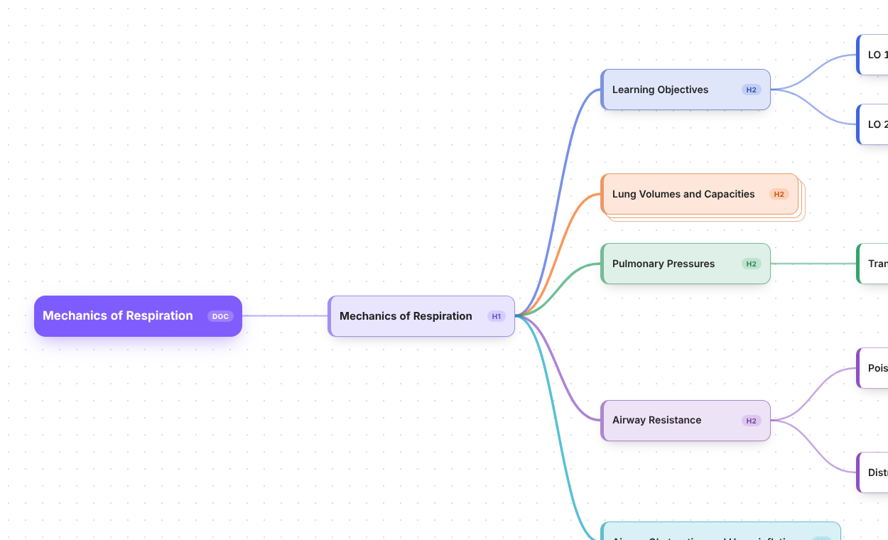
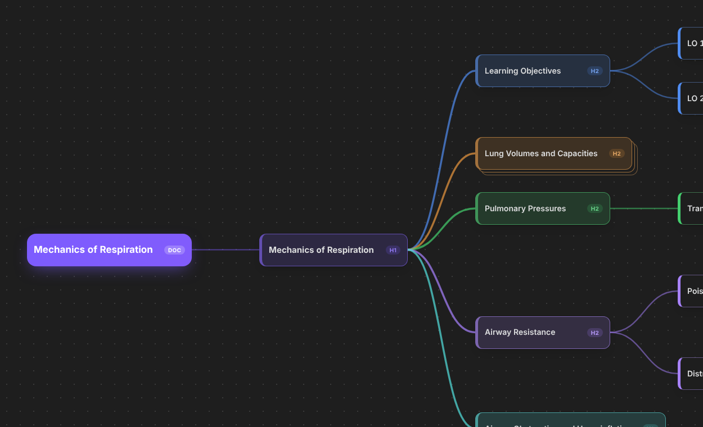

# Heading Mind Map Revamp

Turn the headings of any note into a colorful, draggable mind map, and edit each section in the editor beside it.

Every note you write already has an outline: its headings. This plugin turns that outline into a mind map you can drag around, color and edit, while your notes stay plain Markdown. Nothing is saved anywhere else, so the map is just another way of looking at the same file.

It started as a fork of [Heading Mindmap](https://github.com/JhihJian/obsidian-heading-mindmap) by JhihJian (MIT licensed), which is no longer maintained. This version is English-only and still being worked on.




## Features

- **Headings become a mind map.** Open any Markdown note as a mind map. The file name is the root, and every real heading (including several H1s) is a node.
- **Pretty and readable.** Color-coded branches that follow your Obsidian theme (light and dark), a highlighted root, depth shading, curved edges, a dotted canvas, and a stacked-card look on collapsed nodes.
- **Edit with Obsidian's own editor.** Selecting a node opens that section in a normal Obsidian tab beside the map, with only the selected heading and its text visible (everything else in the file is hidden and locked). Prefer something simpler? Switch to the built-in pane in the settings.
- **Drag to reorder.** Drag a node into the gap between two nodes and a line shows where it will land. Drop it on the right half of a node to make it a child. Subtrees move with it and heading levels adjust automatically.
- **Pan and zoom.** Drag the background to move around, zoom with the toolbar or `Ctrl` + scroll, or fit the whole map to the window.
- **Edit the structure from the keyboard.** Add, delete, promote and reorder nodes; rename headings inline.
- **File nodes.** Add other notes as nodes and expand their headings as a read-only outline.
- **Optional list items.** Show a section's bullet and numbered items as read-only child nodes.
- **Remembers your view.** Collapsed nodes, expanded file nodes, selection, scroll and zoom are restored.

## Install

### From the community plugin list

Once the plugin has been accepted: open **Settings → Community plugins → Browse**, search for **Heading Mind Map Revamp**, install it, and turn it on.

### With BRAT (works today)

1. Install the **BRAT** community plugin and turn it on.
2. Open BRAT's settings and choose **Add beta plugin**.
3. Paste this repository's address and confirm. BRAT installs the plugin and keeps it updated.
4. Turn on **Heading Mind Map Revamp** under **Settings → Community plugins**.

### Manually

1. Download `main.js`, `manifest.json` and `styles.css` from the latest [release](../../releases/latest).
2. Create the folder `.obsidian/plugins/heading-mind-map-revamp/` inside your vault (turn on hidden files to see `.obsidian`) and put the three files in it.
3. Restart Obsidian and turn the plugin on under **Settings → Community plugins**.

> If you have the original *Heading Mindmap* plugin installed, you can keep it or remove it. The two do not conflict, but your saved view state (collapsed nodes, zoom) is not shared between them.

## Usage

Open a note, press `Ctrl/Cmd + P` and run **Open mind map** (or use the ribbon icon). If the current tab is already a mind map of the same note it is reused; otherwise a new tab opens so your normal note stays available.

| Key | Action |
| --- | --- |
| Arrow keys | Move the selection |
| `Enter` | Rename the selected heading |
| `Ctrl/Cmd + Enter` | Jump into the note editor |
| `Tab` | Add a child node |
| `Shift + Enter` | Add a sibling node |
| `Shift + Tab` | Promote the node one level |
| `Alt + Up / Down` | Move the node among its siblings |
| `Space` | Collapse or expand the subtree |
| `Delete` | Delete the node |
| `Ctrl/Cmd + Space` | Hide or show the note editor |

The keyboard button in the toolbar shows this table again.

### Settings

**Settings → Heading Mind Map Revamp → Note editor** chooses where a section is edited: **Obsidian editor (separate tab)**, the default, or the **Built-in pane** inside the mind map. There is also a switch for diagnostic messages, which is only useful when troubleshooting.

## Notes and limits

- Dragging nodes, headings up to level six, and an optional list-item view are supported; full undo/redo integration is not.
- Tables and embedded images are shown as plain Markdown in the built-in pane's editor (the Obsidian editor tab shows them normally).

## Development

```sh
npm install
npm run lint
npm test
npm run build
```

`npm run build` produces `main.js`. To try the plugin in a vault, copy `main.js`, `manifest.json` and `styles.css` into `<vault>/.obsidian/plugins/heading-mind-map-revamp/`, or run `npm run deploy -- "<path to vault>"`.

Releases are built by GitHub Actions: see [docs/COMMUNITY_RELEASE.md](docs/COMMUNITY_RELEASE.md). More background is in [docs/PRD.md](docs/PRD.md), [docs/ARCHITECTURE.md](docs/ARCHITECTURE.md) and [FORK_NOTES.md](FORK_NOTES.md).

## Credits and license

Created by Aero, based on Heading Mindmap by [JhihJian](https://github.com/JhihJian). Released under the [MIT License](LICENSE); the original copyright notice is kept as the license requires.
